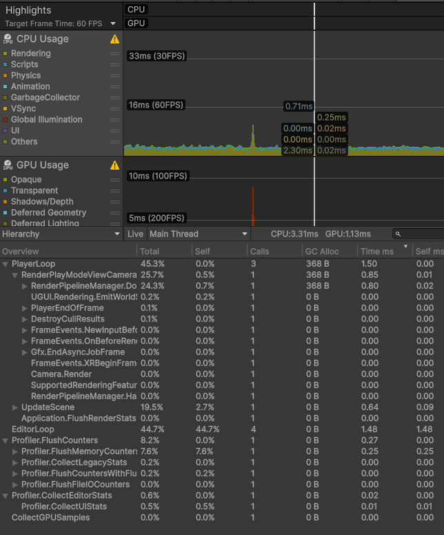
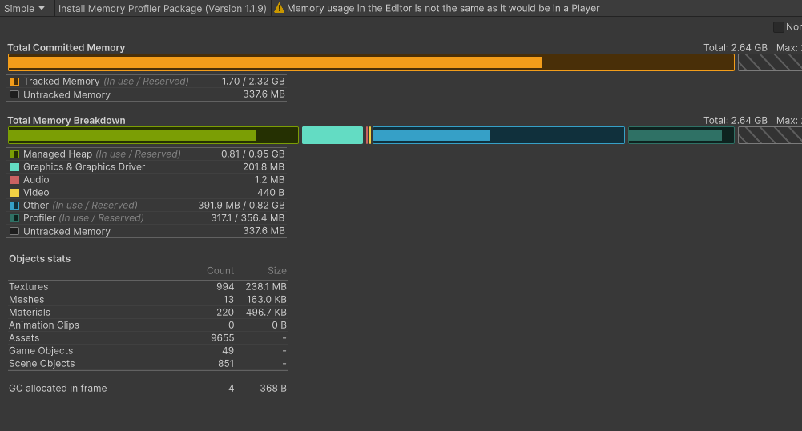
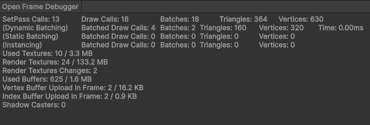

# Performance Baseline – Ironhollow (Galaxy S20 FE)

| Metric | Result | Notes |
|--------|---------|-------|
| Device | Samsung Galaxy S20 FE (Exynos 990) | 6 GB RAM • Android 14 |
| Frame-Time Avg | 3.31 ms | Achieved Capped 60fps |
| 99th Percentile | 16 ms | |
| CPU / GPU Split | 3.31 ms / 1.13 ms | |
| GC Allocs / Frame | 368 B | |
| Total Memory | 420 MB | |
| Draw Calls / Batches | 18 / 18 | |
| Resolution / Scale | 1080p @ 14.0x | |
| Thermals | Start: 39 °C → +10 min: 44 °C | |
| Cold Start Time | 2.7 s  | |
| APK Size | 47 MB | |

### Bottleneck Fix
| Category | Description |
|-----------|--------------|
| **Identified Issue** | UI Event Responsiveness (Touch Input Bottleneck) |
| **Fix Applied** | Switched to Input System only, removed legacy UnityEngine.Input calls, and unified all interaction under the new action map (Polarity, TouchTap). |
| **Before / After** | N/A (No recorded Data) |

-------------------------------

## Screenshots of Metrics

